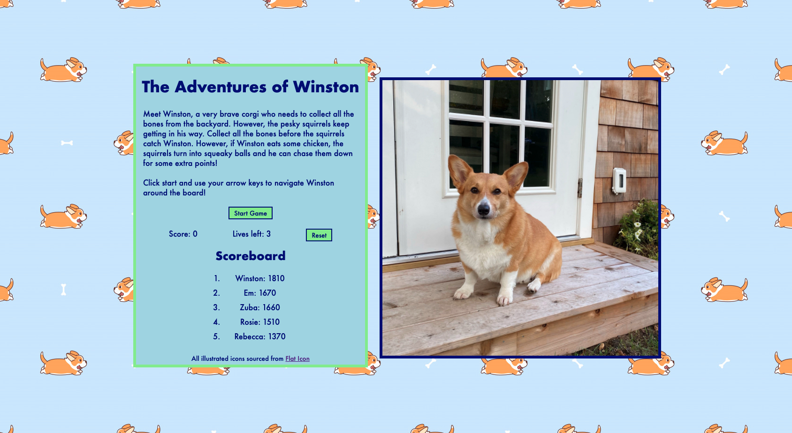
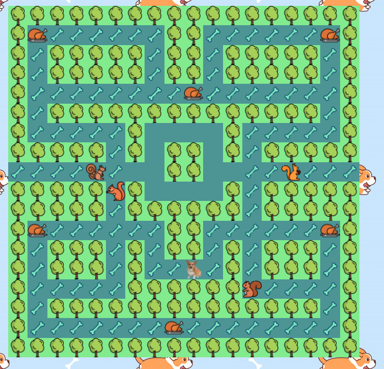
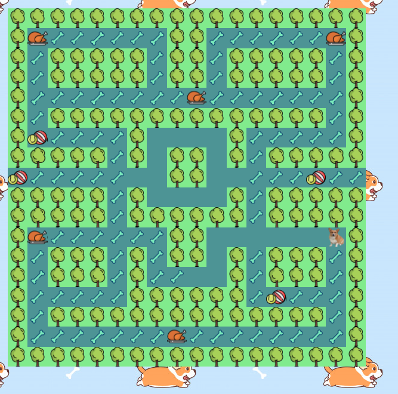

###  General Assembly, Software Engineering Immersive
# The Adventures of Winston: a Pac Man game


## Overview

This is my first project of the software engineering immersive course at GA London. The assignment was to create a grid-based game to be rendered in the browser, using HTML, CSS and JavaScript. The project was to be completed **individually** within **one week**.

I chose to create a game based on Pac Man, using my dog, Winston, as the inspiration for themeing and design. 

You can play the game here (it works best on a desktop): https://emilieeileen.github.io/project-1-pacman/
## Brief

- **Render a game in the browser**
- **Design logic for winning & visually display which player won**
- **Include separate HTML / CSS / JavaScript files**
- Stick with **KISS (Keep It Simple Stupid)** and **DRY (Don't Repeat Yourself)** principles
- Use **Javascript** for **DOM manipulation**
- **Deploy your game online**, where the rest of the world can access it
- Use **semantic markup** for HTML and CSS (adhere to best practices)

## Technologies used

- HTML
- CSS
- JavaScript (ES6)
- Git and GitHub
- Canva
- Flat Icon

## Screenshots

Homepage


Gameboard 



Gameboard with Squirrels as Squeaky Toys

### Board layout 

I decided to use a grid based board for my layout. To achieve this, I created a For Loop, which generated new cells, creating a 18x18 grid.
```js
for (let index = 0; index < width ** 2; index++) {
    const cell = document.createElement('div')
    cell.classList.add('cell')
```

I decided early on that the grid layout should determine what cells would be walls, the holding area, the chickens and the bones. To do this, I preset arrays, classifying the cells that would hold these unique classes.

This also allowed me to preset the squirrels in the holding area as well as Winston on his starting point.

To hide the board when the page first loads, I set an overlay over the board location. This allowed me to prevent the player from moving Winston before the game starts but also allowed me to include a picture of Winston, which is then used as the 'pacman' icon during game play. The overlay is called with the function `on()`. This sets the overlay when the page loads. When the player clicks start, the overlay is turned off via the `off()` function.

### Ghost movement 
A challenge early on was how to set a standard movements to get the ghosts out of the holding area, then moving about the board randomly, without returning to the holding area unless eaten by Winston when in the frightened, or squeaky toy state. 

Firstly, a set Interval is set so the squirrel moves either down two spaces or up one space. then, a function is called to move them either left or right two spaces. Then the random movements function for each squirrel is called, beginning their movements across the board. 
The following is an example of how ghost1 (or Squirrel1) moves out of the holding area and then randomly around the board, moving every half second.
```js
 function moveGhost1() {
    clearInterval(ghost1Interval)
    const downInterval = setInterval(() => {
      cells[ghost1].classList.remove('ghost1')
      ghost1 += 18
      cells[ghost1].classList.add('ghost1')
    }, 500)
    setTimeout(() => {
      clearInterval(downInterval)
      moveLeft()
    }, 1000)
  }
function moveLeft() {
    if (ghost1 === 151) {
      const leftInterval = setInterval(() => {
        cells[ghost1].classList.remove('ghost1')
        ghost1 -= 1
        cells[ghost1].classList.add('ghost1')
      }, 500)
      setTimeout(() => {
        clearInterval(leftInterval)
        ghost1RandomMovements()
      }, 1000)
    }
  }
function ghost1RandomMovements() {
    clearInterval(ghost1Interval)
    let direction = ghostDirection[Math.floor(Math.random() * ghostDirection.length)]
    ghost1Interval = setInterval(() => {
      if (cells[winston].classList.contains('ghost1')) {
        winstonAndGhosts()
      } else if (!cells[ghost1 + direction].classList.contains(ghost2) && !cells[ghost1 + direction].classList.contains('walls') && !cells[ghost1 + direction].classList.contains('holdingArea')) {
        if (cells[ghost1].classList.contains('dogball')) {
          cells[ghost1].classList.remove('ghost1', 'dogball')
          ghost1 += direction
          cells[ghost1].classList.add('ghost1', 'dogball')
        } else {
          cells[ghost1].classList.remove('ghost1')
          ghost1 += direction
          cells[ghost1].classList.add('ghost1')
        }
      } else direction = ghostDirection[Math.floor(Math.random() * ghostDirection.length)]
    }, 500)
  }


```
### Winston movements
Winston's movements begin as the game does. For this, I set his movements to ruin with the down press of the arrow keys. That way, if the player wanted to move Winston continuously in one direction, they could hold down the respective arrow key. The following code shows an example of how Winston is unable to move through the wall cells or holding cells. 

```js
if (key === 'ArrowRight' && !(winston % width === width - 1) && !(cells[winston + 1].classList.contains('walls')) && !(cells[winston + 1].classList.contains('holdingArea'))) {
      cells[winston].classList.remove('winston')
      winston += 1
```

The only exception here is for the middle travel corridor, which allows Winston to hop back and forth between the left and right sides of the board.


### Collisions 
Collision rules are set in both the Winston and ghost movements. They are set based on if a cells contains (or does not contain) certain classes. This then triggers a set of functions which determine whether winston or one of the squirrel/ghosts need to return to their start position.

Every time Winston collides with a squirrel, a life is lost and the function `checkLives()` is run. `checkLives()` sees how many lives are left. If the lives count equals 0, the game ends and an alert pops up with the player's score.

### Power-ups and 'frightened' state 
Like the collisions the process for 'eating' bones and chickens lies within the code for Winston's movements.

When Winston enters a cell that contains a class of bone, the bone class is removed and 10 points are added onto the score.

To win the game, the player must collect all the bones from the board. To keep track of this, I set a variable called boneCount to 117, the number of bones on the board when the game begins. As Winston moves into a cell with the class of bone, the boneCount decreases by one as he removes that class from the cell. When the boneCount equals zero, an alert pops up telling the player they won and displays their final score. 

For the chickens, a set Interval is called when Winston 'eats' the chicken. This sets a 5 second interval which add the dog balls class to the the squirrels on the squirrel. The icon changes to dog toys and Winston is allowed to eat them for an extra 50 points each.

When Winston eats the dog toys, the squirrels are sent back to holding. after the interval clears, the squirrels repeat the function that allows them to exit the holding area and begin to move randomly on the board again. 

I had encountered a bug where is Winston moved quick enough, he could eat the chicken before the squirrels left the holding area. This left stray dog ball icons in the holding area after the squirrels moved out. To solve this, I simply hard coded in some statements to prevent the dog ball class from being added into any cells in the holding area. 

### Scoreboard
I decided to add on a scoreboard so players can track their score. I used localStorage to ensure that all scores are saved on the player's browser. 
I began by presetting in an array with a pre-determined set of high scores so the player has scores to play against. To keep with the theme, I named these after the dogs I had growing up, with Winston holding the top score. 

```js
if (localStorage) {
  playerScores = JSON.parse(localStorage.getItem('scoreboard')) || [
    { name: 'Rosie', finalScore: 1510 },
    { name: 'Rebecca', finalScore: 1370 },
    { name: 'Winston', finalScore: 1810 },
    { name: 'Zuba', finalScore: 1660 },
    { name: 'Emma', finalScore: 1040 }
  ]
}
function orderAndDisplayScores() {
  const array = playerScores
    .sort((playerA, playerB) => playerB.finalScore - playerA.finalScore)
    .slice(0, 5)
    .map(player => {
      return `<li>
     ${player.name}: ${player.finalScore}
     </li>`
    })
  scoreList.innerHTML = array.join('')
}
orderAndDisplayScores()
```

When the player finishes the game (or loses) a prompt alert appears asking for the player's name. When they enter it, it checks the localStorage to see if the score beats any of those listed in the top 5. If it does, it replaces that score and is saved on the scoreboard. 

### Variables 
- `winston` for the winston icon
- `ghost1` etc. for the squirrel icons I had set this variable before styling the ghosts as squirrels. To keep consistent and prevent errors, I kept the class named ghost.
- `cells` for the grid cells
- `chicken` for the chicken power ups
- `bones` 
- `walls`
- `holding area` The section of the board where the squirrels start off and are sent back to if they are eaten as dog toys.
- `dog ball` the dog toy class

## Bugs 
- If Winston moves too quickly, he may pass through a squirrel or dog ball without colliding or eating it. 

## Potential future features
- Mobile Compatability
- Add more difficult levels with unique boards
- More Intelligent movements for the squirrels

## Wins and Challenges

# Wins
- Successfully creating functions for the movements of the squirrels, especially for how the squirrels exit the holding area.
- Implmenting a custom CSS sytling
- Learning how to utilise localStorage for the high scoreboard

# Challenges
- Fixing the bugs for when the Winston eats the chicken and the dog balls return to the holding area

## Lessons learned

I am very proud that I was able to create this game after only 3 weeks of training. I think I learned valuable time management skills, especially in ensuring I had an MVP completed with enough time to add in extra content and styling.

Additionally, I think that I learned how to set out a plan to code, working in increments instead of writing it all out at once then testing. 

One aspect of planning that I will continue to use in future projects is my Positivity and Challenge logs. 

## Artwork and credit
I used Flat Icon to get all the illustrated icons on my grid. For the Winston icon, I used Canva Pro to create a png image of Winston.
